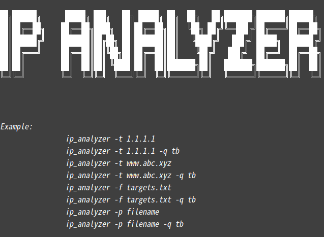
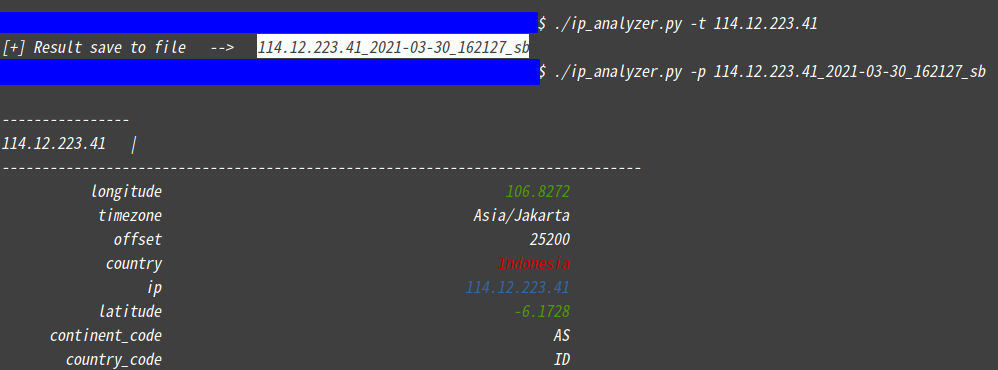
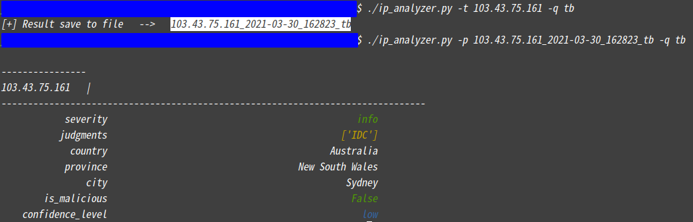

# ip analyzer

## Desc

​	A simple ip/domain analyzer base on online api.

​	Support ip and domain name query.

​	Support result storage and parse.

​	Support batch processing.

​	Easy to use.

 

## Overview

 

Example: 

​	Default query and parse:

​	Threat info query and parse:

